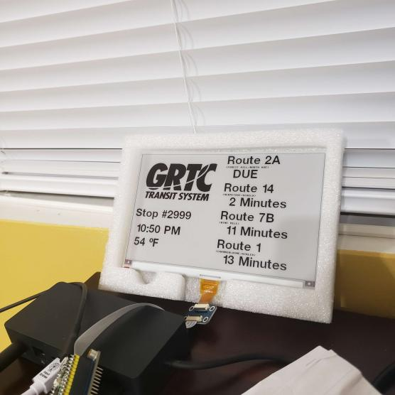

# A Cost-effective and Tactical Bus Timetable Device

- Utilizes API from Bustime(R)-compatible transit systems
- Shows current time, temperature, and next four departures on an E-Paper display.
- Total Device BOM is under $100 with simple setup.

# Future Goals
- 3D Printed Weatherproof Case with appropriate ports for mounting to a bus stop sign.
- Solar panel and battery for indefinite operation
- LTE data connection to get results without an existing Wi-Fi network.
- Search for E-paper display with partial refresh for faster results display.
- Research whether other microcontroller boards (e.g. Pi Zero) will process text faster.

# Media

